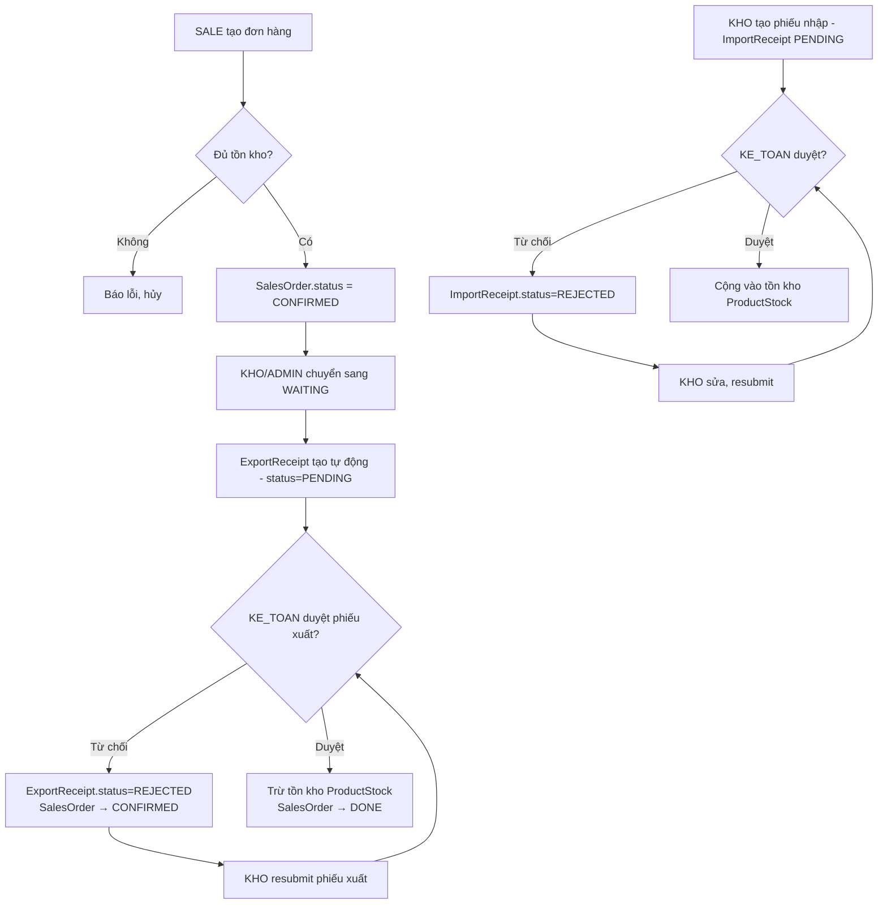

# 📋 Business Analysis Report — TeLiet_Quanlykho

> **Project:** Quản lý kho vật liệu xây dựng (Construction Materials Warehouse Management)
> **Stack:** Django (Python), MySQL, Session Auth + JWT (dual), Class-Based Views, Repository–Service pattern
> **Analyzed on:** 2026-04-13

---

## A. Business Flow — Inventory Reconciliation (End-to-End)



**Luồng Hủy đơn:**
- `CANCELLED` → Tìm ExportReceipt có `note__icontains(order_code)` → Nếu đã APPROVED thì hoàn kho và đặt ExportReceipt.status = `REJECTED`

---

## B. Data Model

### Entities & Relationships

| Table | Key Fields | Ghi chú |
|---|---|---|
| `users` | id (UUID), username, role {ADMIN, SALE, KHO, KE_TOAN}, full_name | Custom User kế thừa AbstractUser |
| `categories` | id (UUID), name (unique) | Danh mục sản phẩm |
| `products` | id (UUID), name, base_price, base_unit, image_url, category_id | Sản phẩm |
| `product_units` | id (UUID), product_id, unit_name, conversion_rate | Đơn vị quy đổi |
| `product_stocks` | id (UUID), product_id (OneToOne), quantity, last_updated | **Tồn kho thực tế** |
| `import_receipts` | id (UUID), receipt_code, created_by, reviewed_by, status, note, rejection_note | Phiếu nhập kho |
| `import_receipt_items` | receipt_id, product_id, quantity, unit_price, note | Dòng chi tiết phiếu nhập |
| `export_receipts` | id (UUID), receipt_code, created_by, reviewed_by, status, note, rejection_note | Phiếu xuất kho |
| `export_receipt_items` | receipt_id, product_id, quantity, unit_price, note | Dòng chi tiết phiếu xuất |
| `sales_orders` | id (UUID), order_code, customer_name, customer_phone, status, note, created_by | Đơn hàng bán |
| `sales_order_items` | order_id, product_id, quantity, unit_price | Dòng chi tiết đơn hàng |
| `customer_debts` | id (UUID), sales_order_id, customer_name, remaining_amount, due_date, status | Công nợ khách hàng |

### ERD (Simplified)

```
Category ──< Product >── ProductUnit
                │
           ProductStock (1:1)
                │
     ImportReceipt ──< ImportReceiptItem >── Product
     ExportReceipt ──< ExportReceiptItem >── Product
        │ (linked by note string)
     SalesOrder ──< SalesOrderItem >── Product
        │
     CustomerDebt
```

> [!WARNING]
> Liên kết giữa `ExportReceipt` và `SalesOrder` **không có FK thực sự** — chỉ dùng regex parse `note` field. Đây là điểm rủi ro nghiêm trọng.

---

## C. Mapping AC → Code

### C1. Inventory Loss Features

---

#### AC-1: Display inventory discrepancy (system vs actual)

| Tiêu chí | Đánh giá |
|---|---|
| Module xử lý | `apps/warehouse/views.py` → `StockListView`; `repositories.py` → `ProductStockRepository.get_all()` |
| Template | `warehouse/stock_list.html` (tồn tại trong dự án) |
| Trạng thái | ⚠️ **PARTIALLY IMPLEMENTED** |

**Phân tích:**
- Hệ thống hiển thị tồn kho **theo hệ thống** (`ProductStock.quantity`) ✅
- **Không có cột "tồn kho thực tế"** (actual physical count) — không có bảng kiểm kê riêng (inventory audit / stocktaking)
- `StockListView` chỉ render `ProductStock`, không có so sánh với số lượng kiểm đếm thực tế
- "Tồn kho thực" = số lượng nhập vào trừ số lượng xuất ra, không phải số đo kiểm thực địa

**Bug/Risk:** Không có entity `InventoryAudit` hay `StocktakingRecord`. Không có chức năng nhập số lượng kiểm thực tế. Cột `ketoan01` chỉ có quyền `view_product` (permission 28) — không có quyền trên `warehouse` module.

---

#### AC-2: Record loss reasons

| Tiêu chí | Đánh giá |
|---|---|
| Module xử lý | Không có module chuyên biệt |
| Trạng thái | ❌ **MISSING** |

**Phân tích:**
- Không có model `LossRecord`, `InventoryLoss`, hay bất kỳ entity nào cho việc ghi nhận mất mát/hao hụt
- Trường `note` trong `ExportReceipt` và `ImportReceipt` là ghi chú chung, không phải ghi nhận lý do hao hụt có cấu trúc
- Không có form hay view nào cho phép khai báo số lượng hao hụt với lý do cụ thể

---

#### AC-3: Classify loss types (damage vs natural shrinkage)

| Tiêu chí | Đánh giá |
|---|---|
| Module xử lý | Không có |
| Trạng thái | ❌ **MISSING** |

**Phân tích:**
- Không tồn tại enum/field `loss_type` (VD: `DAMAGE`, `SHRINKAGE`, `THEFT`, `EXPIRED`)
- Toàn bộ module `apps/inventory/` chỉ có `__init__.py` — module này **rỗng hoàn toàn**
- Đây là tính năng chưa được phát triển

---

### C2. Report Export Features

---

#### AC-4: Export Excel

| Tiêu chí | Đánh giá |
|---|---|
| Module xử lý | Không tìm thấy |
| Trạng thái | ❌ **MISSING** |

**Phân tích:**
- `requirements.txt` cần kiểm tra có `openpyxl` / `xlrd` / `xlwt` không
- Không tìm thấy bất kỳ view nào có `HttpResponse` với `content_type='application/vnd.openxmlformats...'`
- Không có URL nào cho `/export/excel/` hay tương đương
- Dashboard (`core/views.py`) dùng dữ liệu mẫu hardcode — không connect DB thực

---

#### AC-5: Export PDF

| Tiêu chí | Đánh giá |
|---|---|
| Module xử lý | Không tìm thấy |
| Trạng thái | ❌ **MISSING** |

**Phân tích:**
- Không có dependency `reportlab`, `weasyprint`, `xhtml2pdf` trong codebase
- Không có view nào trả về `content_type='application/pdf'`

---

#### AC-6: Ensure exported data matches system

| Tiêu chí | Đánh giá |
|---|---|
| Trạng thái | ❌ **N/A** (không thể verify vì AC-4/AC-5 chưa implement) |

---

## D. Gaps & Improvements

### 🔴 Critical Gaps

| # | Vấn đề | Vị trí | Mức độ |
|---|---|---|---|
| 1 | **Module inventory hoàn toàn rỗng** | `apps/inventory/__init__.py` | CRITICAL |
| 2 | **Không có Excel/PDF export** | Toàn project | CRITICAL |
| 3 | **Liên kết Order → ExportReceipt bằng string parsing** | `warehouse/repositories.py:L214-L230` | HIGH |
| 4 | **Dashboard dùng dữ liệu hardcode** | `core/views.py:L95-L114` | HIGH |
| 5 | **Không có kiểm kê thực tế / Inventory Audit** | Toàn project | HIGH |
| 6 | **Không có phân loại hao hụt** | Toàn project | HIGH |

### 🟡 Logic Bugs

#### Bug 1 — Stock không bị trừ khi tạo đơn hàng, nhưng validation check stock
```python
# order/repositories.py:L55-L79
# Kiểm tra tồn kho trước khi tạo đơn
stock = ProductStockRepository.get_stock(item['product_id'])
available = stock.quantity if stock else 0
if available < item['quantity']:
    errors.append(...)
```
```python
# order/repositories.py:L97-L105 (đã comment out)
# KHÔNG trừ kho ngay - chỉ trừ khi phiếu xuất được duyệt
```
**Vấn đề:** Hệ thống check stock tại thời điểm tạo đơn nhưng **không lock/reserve** số lượng đó. Nếu 2 nhân viên sale cùng đặt hàng cho cùng 1 sản phẩm tồn 10 cái, cả 2 đơn đều được tạo. Đây là **race condition** nghiêm trọng.

#### Bug 2 — Hủy đơn dùng ExportReceipt.status = 'REJECTED' nhầm nghĩa
```python
# order/repositories.py:L134-L137
receipt.status = 'REJECTED'
receipt.rejection_note = f'Hoàn hàng do hủy đơn {order.order_code}'
receipt.save()
```
**Vấn đề:** `REJECTED` có nghĩa "kế toán từ chối phiếu", nhưng ở đây bị dùng để biểu thị "phiếu đã hoàn hàng do hủy đơn". Không có status `CANCELLED` hay `RETURNED` cho ExportReceipt. Logic báo cáo sẽ bị sai.

#### Bug 3 — `ExportReceiptApproveView` không kiểm tra quyền
```python
# warehouse/views.py:L307-L315
class ExportReceiptApproveView(LoginRequiredMixin, View):
    def post(self, request, pk):
        service = ExportReceiptService()
        success, msg = service.approve_receipt(pk, request.user)
        ...
```
**So sánh với `ImportReceiptApproveView` (L150-L162) có kiểm tra:**
```python
if request.user.role not in ('KE_TOAN', 'ADMIN') and not request.user.is_superuser:
```
`ExportReceiptApproveView` và `ExportReceiptRejectView` **không có role check** → mọi role đều có thể duyệt/từ chối phiếu xuất.

#### Bug 4 — `ProductUnitCreateView` gọi service 2 lần
```python
# product/views.py:L268-L297
unit, msg = service.add_new_unit_to_product(product_id, unit_name, rate)  # Gọi lần 1
# ... sau đó validate lại và gọi lần 2
unit, msg = service.add_new_unit_to_product(data['product_id'], data['unit_name'], data['conversion_rate'])
```
**Vấn đề:** `add_new_unit_to_product` được gọi **2 lần** trong cùng một request. Lần đầu có thể thành công, lần thứ 2 sẽ fail với "Đơn vị đã tồn tại" hoặc tạo bản ghi trùng tùy vào unique constraint.

#### Bug 5 — Receipt code generation có race condition
```python
# warehouse/repositories.py:L39-L45
count = ImportReceipt.objects.filter(
    receipt_code__startswith=f'PN-{date_str}'
).count() + 1
return f'PN-{date_str}-{count:03d}'
```
**Vấn đề:** 2 request đồng thời cùng ngày → cùng count → trùng `receipt_code` → unique constraint violation. Cần dùng `select_for_update()` hoặc sequence DB.

#### Bug 6 — `CustomerDebtListView` bỏ qua `is_superuser`
```python
# order/views.py:L210
'user_role': request.user.role,
```
Các view khác dùng pattern:
```python
'user_role': 'ADMIN' if user.is_superuser else user.role,
```
Superuser mà `role=''` (như user `admin` trong SQL dump) sẽ có `user_role=''` → template có thể render sai.

### 🟢 Suggestions

1. **Thêm `InventoryAudit` model** với các field: `product`, `counted_quantity`, `system_quantity`, `discrepancy`, `loss_type` (enum), `loss_reason`, `audited_by`, `audit_date`
2. **Thêm FK thực sự** `ExportReceipt.sales_order = ForeignKey(SalesOrder, null=True)` thay vì parse string
3. **Implement report export** với `openpyxl` (Excel) và `weasyprint`/`reportlab` (PDF)
4. **Thêm `RESERVED` quantity** vào `ProductStock` để xử lý race condition khi nhiều đơn hàng cùng lúc
5. **Dashboard** cần connect DB thực, không dùng dữ liệu mẫu
6. **Thêm status `RETURNED`/`CANCELLED`** vào ExportReceipt

---

## E. Edge Cases & Risks

### E1. Data Inconsistency

| Tình huống | Mô tả | Nguy cơ |
|---|---|---|
| Stock âm | `ExportReceipt.approve()` có `if stock.quantity < 0: stock.quantity = 0` → tắt cảnh báo thay vì chặn | Mất dữ liệu, kho âm được silently reset |
| Order cancel sau DONE | `DONE` → `CANCELLED` không được phép (VALID_TRANSITIONS.DONE=[]) nhưng không có giao diện cảnh báo | Đơn đã giao không thể hoàn hàng qua UI |
| ExportReceipt note parse fail | Nếu note không khớp regex `DH-\d{8}-\d+` thì order không được cập nhật DONE | Order mãi ở WAITING dù hàng đã xuất |
| RejectReceipt không check stock đã trừ chưa | `reject()` trong ExportReceipt không rollback stock nếu approve đã trừ rồi | Hàng đã xuất, phiếu bị reject sau đó → kho sai |

### E2. Rounding Issues

| Vị trí | Vấn đề |
|---|---|
| `SalesOrderItem.subtotal` | `quantity * unit_price` dùng Python `Decimal` × `Decimal` → OK |
| `_products_json()` | `float(p.base_price)` → chuyển Decimal sang float → mất độ chính xác với giá lớn |
| `_stocks_json()` | `float(s.quantity)` → tương tự |
| `ProductUnit.conversion_rate` | `Tấn = 0.6667 của Khối` → rounding error tích lũy dài hạn |

### E3. Large Dataset Performance

| Vị trí | Vấn đề |
|---|---|
| `SalesOrder.total_amount` (property) | `sum(item.subtotal for item in self.items.all())` → N+1 query nếu không prefetch |
| `StockListView` | `ProductStockRepository.get_all()` dùng `select_related('product__category')` → OK |
| `_get_import_receipt_stats()` | 4 COUNT queries mỗi page load → nên cache |
| Cancel order search | `ExportReceipt.objects.filter(note__icontains=order.order_code)` → LIKE '%...%' không dùng index |
| Pagination | PAGE_SIZE=5 (nhập/xuất kho) — quá nhỏ cho dataset lớn |

### E4. Security

| Vấn đề | Vị trí |
|---|---|
| SALE role có thể xem toàn bộ đơn hàng | `SalesOrderListView.get()`: `else: orders = service.get_all()` với role KHO |
| ExportReceipt approve không check role | `ExportReceiptApproveView` — **ai cũng duyệt được** |
| `admin` user trong DB có `role=''` (rỗng) | Sẽ không match bất kỳ role check nào trừ `is_superuser` |

---

## Tóm tắt Trạng thái AC

| Acceptance Criteria | Trạng thái | File chính |
|---|---|---|
| Hiển thị chênh lệch tồn kho | ⚠️ Partial | `warehouse/views.py`, `stock_list.html` |
| Ghi nhận lý do hao hụt | ❌ Missing | — |
| Phân loại hao hụt (hỏng vs tự nhiên) | ❌ Missing | — |
| Export Excel | ❌ Missing | — |
| Export PDF | ❌ Missing | — |
| Dữ liệu xuất khớp hệ thống | ❌ N/A | — |

